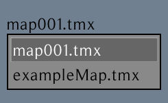
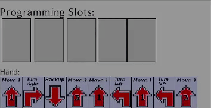

# Manual testing:

## Prerequisites:

### Project repository:
<p>The latest <a href=https://github.com/inf112-v21/The-Dijkstras/tags>release.</a></p>

### Debug mode enabled:
In GameScreen.java, change debugMode value to "true".


```java
private boolean debugMode = true;
```


## Testing:
### Initialization:
In your IDE of choice, preferably IntelliJ IDEA, run Main.java


### Title Screen:

Compare to reference the [image.](../assets/images/title_screen.png)
You should also be able to hear the main menu theme, if not check your application volume settings / volume mixer.
### Checkboxes:

 

... should be clickable and functional. Test them out by clicking Singleplayer or Multiplayer.

### Exit Button: 

Pressing the Exit Button should exit the game and its processes. Investigate running processes in Task Manager / System Monitor etc.

### Game Screen (Singleplayer / Multiplayer):

Compare to reference the [image.](../assets/images/game_screen.png)
The general layout should look the same as in the image. All elements should be visible as shown.
Otherwise, with debug mode, see if any layout boundaries are overlapping in a way that prevents an element from being shown,
and also control the robot with WASD, arrow keys or interface buttons.

### Gameplay:

As mentioned, you can debug movements with WASD or play the game as regular. 

Press the Start Round button to start the first round of the game. Cards will be deployed to the programming hand slot from which you can pick upto 5 cards by clicking on them.



You should also be able to click on the chosen cards to undo a card/cards.

