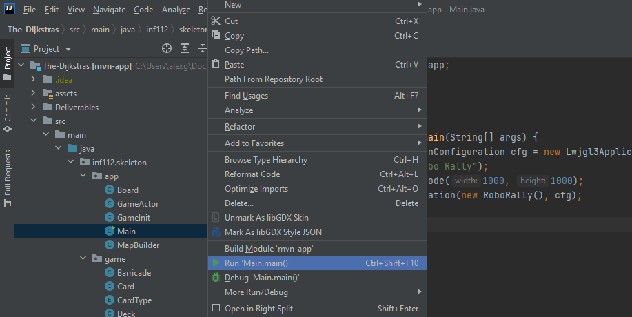
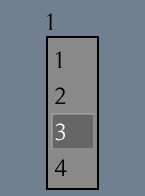
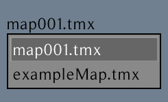
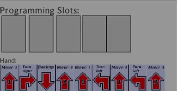
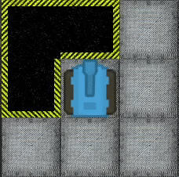
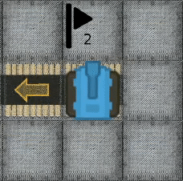

# Manual testing:

## Prerequisites:

### Project repository:
<p>The latest <a href=https://github.com/inf112-v21/The-Dijkstras/tags>release.</a></p>

### Debug mode enabled:
In GameScreen.java line 48, change debugMode value to "true".


```java
private boolean debugMode = true;
```


## Testing:
### Initialization:
In your IDE of choice, preferably IntelliJ IDEA, run Main.java



### Title Screen:

Compare to reference the [image.](../assets/images/title_screen.png)
You should also be able to hear the main menu theme, if not check your application volume settings / volume mixer.
### Checkboxes:

 

... should be clickable and functional. Test them out by clicking Singleplayer or Multiplayer.

### Exit Button: 

Pressing the Exit Button should exit the game and its processes. Investigate running processes in Task Manager / System Monitor etc.

### Game Screen (Singleplayer / Multiplayer):

Compare to the reference [image.](../assets/images/game_screen.png)
The general layout should look the same as in the image. All elements should be visible as shown.
Otherwise, with debug mode, see if any layout boundaries are overlapping in a way that prevents an element from being shown,
and also control the robot with WASD, arrow keys or interface buttons.

### Gameplay:

You can debug movements with WASD or play the game as regular. 

Press the Start Round button to start the first round of the game. Cards will be deployed to the programming hand slot from which you can pick upto 5 cards by clicking on them.



You should also be able to **click** on the chosen cards to undo a card/cards.

After choosing cards 
(*if you have chosen less than 5, programming slots will be filled from the players hand in randomized order*),
press the **Ready Button** to initiate the round.


The robot will then perform the card moves one by one. If the robot steps in a hole it should indicate death by an 
explosion texture, and for flags it should change to a celebratory texture.

If your robot takes damage it should get less cards at the start of a round, if for example damage dealt is 4 the player
receives only 5 out of 9 cards. When more damage is dealt, programming slots will be filled with random cards so that
the player always has enough cards to play 5 cards.

 

If your robot takes damage and you want to Power Down the robot to reset to spawn or flag if it has visited one,
reset health, start a new round and press the Power Down button...


...then pick cards, and press the Ready Button. The player still has to 
play out current round, but the following one will reset the robots position and make the robot wait out one round.


