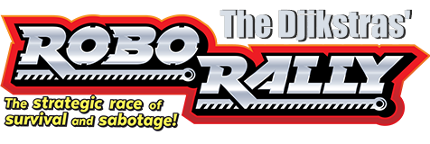

# The Djikstras' RoboRally 🔩⚙🔧
A work-in-progress MVP implementation of RoboRally. 

## Status
*When running Main:*
- Game is playable in SinglePlayer mode *(timer automation yet to be implemented)*.
- Multiplayer is currently in development.

## Running it
*To run:*
- Download the project from https://github.com/inf112-v21/The-Dijkstras using the green button and press download ZIP. 
- Clone the repo: `git clone https://github.com/inf112-v21/The-Dijkstras` 
  or download the latest <a href=https://github.com/inf112-v21/The-Dijkstras/tags>release.</a>
- In your IDE of choice, preferably IntelliJ IDEA, run Main.java `src/main/java/inf112/skeleton/app/main.java`
- Run the Main file to start the game. The application will start in a window: 
  
  

## Testing:
*Running tests:*

   

*Running manual tests (GUI):* refer to [Manual Testing.md](./Deliverables/Manual_Testing.md) instructions.

## Deliverables

*Deliverables contains documents:*
- Meeting minutes
- Pair Programming Scheduele
- Pair Programming reports
- Klassediagram
- ObligDoc1
- ObligDoc2
- Manual_Testing.md

## Known bugs

---
**macOS specific bug:**  
`"Caused by: java.lang.IllegalStateException:\
GLFW windows may only be created on the main thread and that thread must be the first thread in the process"`

**Fix for IntelliJ:**  
`run > edit configurations > modify options > add VM options\`
then add line: `"-XstartOnFirstThread"`

---

